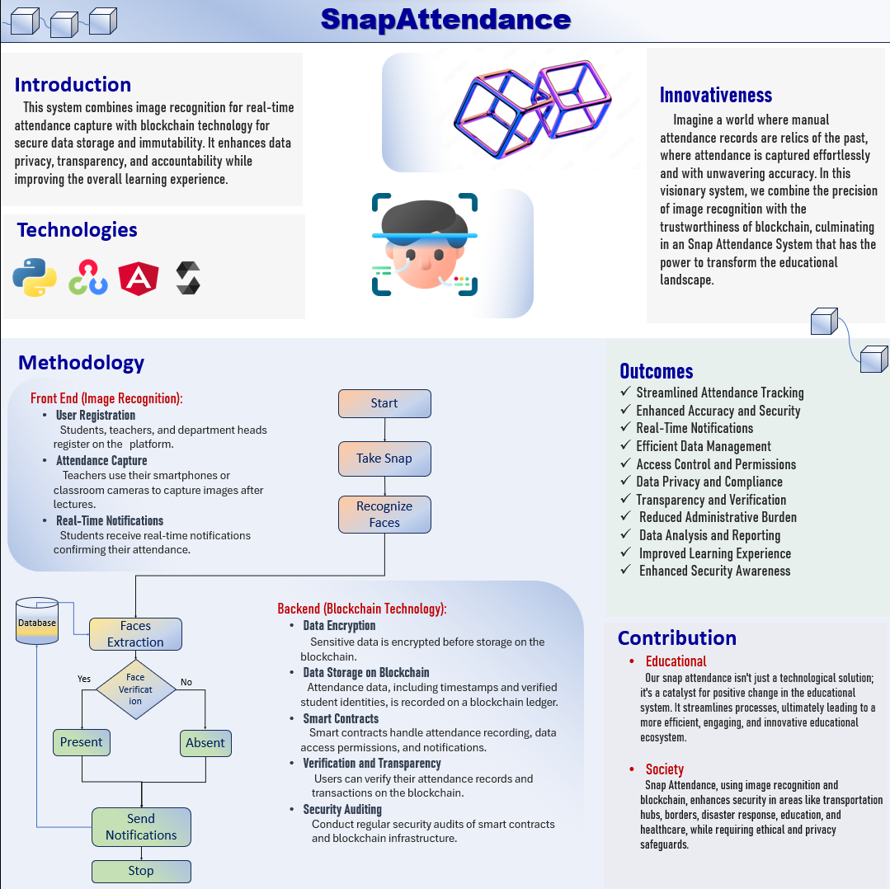

## Snap Attendance System 

**Poster**



---
Here are the core libraries, algorithms, and components are required for building Android app using Python, OpenCV, Angular, and Solidity

#### Components of Snap Attendance
**1. Android App Development:**
   - Android Studio: The primary development environment for Android app development.
   - Java or Kotlin: The programming languages commonly used for Android app development.

**2. Image Recognition (OpenCV):**
   - OpenCV: The Open Source Computer Vision Library provides various tools and functions for image processing, feature detection, and object recognition.
   - Face Detection and Recognition: We'll need algorithms or pre-trained models for detecting and recognizing faces in images. OpenCV provides Haar cascades and deep learning-based models for this purpose.
   - Image Preprocessing: Techniques for enhancing image quality and preparing it for recognition, which may include resizing, normalization, and noise reduction.

**3. Blockchain Integration (Solidity):**
   - Solidity: The smart contract language for Ethereum and Ethereum-compatible blockchains.
   - Ethereum or Binance Smart Chain: Choose a blockchain platform for deploying smart contracts. Ethereum is a popular choice.
   - Web3.js (for Angular): A JavaScript library for interacting with Ethereum smart contracts from the Angular frontend.

**4. Angular Frontend:**
   - Angular: The framework for building the user interface.
   - HTML/CSS: For designing and styling the user interface.
   - Angular HttpClient: For making API calls to the backend.

**5. Backend (Python):**
   - Flask or Django: Python web frameworks to build the backend of application.
   - RESTful API: Create API endpoints for communication between the frontend and the backend.
   - Python libraries for blockchain interaction (e.g., Web3.py for Ethereum).

**6. Database (optional):**
   - We may need a database to store additional data related to attendance, such as user profiles, attendance records, and timestamps.

**7. Machine Learning for Image Recognition:**
   - Machine Learning Models: We may use pre-trained deep learning models for face recognition or train own model using libraries like TensorFlow or PyTorch.
   - Face Embeddings: Techniques like face embeddings (e.g., using the FaceNet model) to represent and compare faces for recognition.

**8. User Authentication and Security:**
   - Implement user authentication and access control to ensure that only authorized users can mark attendance.

**9. Mobile App Features:**
   - Camera Integration: Utilize the device's camera for capturing images.
   - Push Notifications: Notify users of attendance status or other relevant information.
   - GPS (optional): Use GPS for location-based features.

**10. Blockchain Transactions:**
   - Smart Contracts: Design and implement smart contracts for attendance data storage.
   - Wallet Integration: Enable users to sign transactions to record attendance on the blockchain.

**11. Testing and Quality Assurance:**
   - Unit testing, integration testing, and user testing are essential to ensure the reliability of app.

**12. Deployment:**
   - Deploy the backend, smart contracts, and the Angular frontend to appropriate servers or cloud platforms.

---

### Integrate Python image recognition into  Java Android Studio project

**1. Create a Python Image Recognition Script:**
   
   First,need to create a Python script that performs image recognition using a library like OpenCV or a machine learning framework like TensorFlow. Ensure that Python script takes an image as input, processes it, and returns the recognition results.

   For example, let's say We have a Python script named `image_recognition.py`:

```python
# image_recognition.py

import cv2
import sys

# Provide a dummy image path
imagePath = './img.jpeg'

# Load the image
image = cv2.imread(imagePath)
if image is None:
    print("Could not open or find the image.")
    sys.exit(1)

# Convert the image to grayscale
gray = cv2.cvtColor(image, cv2.COLOR_BGR2GRAY)

# Load the face cascade classifier
faceCascade = cv2.CascadeClassifier(cv2.data.haarcascades + "haarcascade_frontalface_default.xml")

# Detect faces in the grayscale image
faces = faceCascade.detectMultiScale(
    gray,
    scaleFactor=1.3,
    minNeighbors=3,
    minSize=(30, 30)
)

# Print the number of faces found
print("[INFO] Found {0} Faces!".format(len(faces)))

# Draw rectangles around the detected faces
for i, (x, y, w, h) in enumerate(faces):
    cv2.rectangle(image, (x, y), (x + w, y + h), (0, 255, 0), 2)
    roi_color = image[y:y + h, x:x + w]
    print("[INFO] Face {} found. Saving locally.".format(i+1))
    cv2.imwrite('detected/face{}_{}.jpg'.format(i+1, str(w) + str(h)), roi_color)

# Save the result image with rectangles
status = cv2.imwrite('faces_detected1.jpg', image)
if status:
    print("[INFO] Image faces_detected.jpg written to filesystem.")
else:
    print("[ERROR] Failed to write the image to filesystem.")

# Display the image (optional)
cv2.imshow("Detected Faces", image)
cv2.waitKey(0)
cv2.destroyAllWindows()
```

**2. Prepare Python Environment:**

   Make sure that the Python environment on Android device includes the necessary libraries for image recognition. We might need to install OpenCV or any other required packages.

**3. Android Studio Integration:**

   Now, We need to integrate Python script into Android Studio project.

   - In Android Studio project, create a new Java or Kotlin class that will handle the execution of the Python script.

   ```java
   // PythonIntegration.java (or .kt for Kotlin)
   import java.io.BufferedReader;
   import java.io.InputStreamReader;

   public class PythonIntegration {
       public static String runPythonScript() {
           try {
               Process process = Runtime.getRuntime().exec("python /path/to/image_recognition.py");
               BufferedReader reader = new BufferedReader(new InputStreamReader(process.getInputStream()));
               StringBuilder builder = new StringBuilder();
               String line;

               while ((line = reader.readLine()) != null) {
                   builder.append(line);
               }

               return builder.toString();
           } catch (Exception e) {
               e.printStackTrace();
               return "Error: " + e.getMessage();
           }
       }
   }
   ```

   Replace `/path/to/image_recognition.py` with the actual path to Python script.

**4. Call the Python Integration from Android Activity:**

   In Android app's activity, We can now call the `runPythonScript` method from the `PythonIntegration` class:

   ```java
   String recognitionResult = PythonIntegration.runPythonScript();
   // Process the recognition result as needed
   ```

**5. Handle Permissions:**

   Ensure that Android app has the necessary permissions to access the camera and image files if image recognition script requires them.

**6. Building the Android App:**

   Build and run Android app in Android Studio. When We trigger the image recognition, it will execute the Python script and return the results.

---
### What is Recognition Result
In the context of image recognition, "recognition results" refer to the information or data that the image recognition algorithm or model provides after analyzing an input image. These results can vary depending on the specific use case and the type of recognition being performed. Here are some common examples of recognition results:

1. **Object Recognition:**
   - In object recognition, the results typically include the labels or names of objects detected in the image. For example, if the image contains a dog, a cat, and a chair, the recognition results might include these labels along with confidence scores (e.g., "dog" with 95% confidence).

2. **Face Recognition:**
   - For face recognition, the results could include information such as the names of recognized individuals, unique face identifiers, and the confidence scores associated with each recognition. This is commonly used for security and identity verification applications.

3. **Text Recognition (OCR - Optical Character Recognition):**
   - In text recognition, the results consist of the extracted text from an image. For example, if We scan a printed document, the recognition results would be the text content that has been converted from the image.

4. **Image Segmentation:**
   - In image segmentation, the results might include pixel-level labels or masks that separate different regions or objects within an image. This is often used in medical imaging or scene understanding.

5. **Custom Recognition Tasks:**
   - Depending on the specific application, recognition results can be customized to match the task's requirements. For example, in a medical image analysis application, the results might include detected abnormalities or anomalies.

The recognition results are the output of the image recognition process, and they can be used for various purposes, such as making decisions, taking actions, or providing information to the user. These results are generated by the image recognition algorithm or model based on the patterns and features it has learned from the input image. 


---
### Storing data in a blockchain 
Storing data in a blockchain at the backend using Python involves interacting with a blockchain network, typically via smart contracts. Below are the general steps to store data in a blockchain using Python as the backend:

1. **Choose a Blockchain Platform:**
   First, We need to select a blockchain platform where We want to store data. Popular choices include Ethereum, Binance Smart Chain, and others. choice will determine which blockchain-specific tools and libraries We'll need to use in Python backend.

2. **Set Up Development Environment:**
   Ensure that We have the necessary Python libraries and tools installed to interact with the chosen blockchain. For example, if We are using Ethereum, We might use the Web3.py library.

3. **Create or Use Smart Contracts:**
   We'll need to write or use smart contracts to define the data storage and retrieval logic on the blockchain. These contracts will specify how data is stored, who can access it, and the rules for modifying or reading data. We typically write these contracts in a language like Solidity (for Ethereum).

4. **Interact with Smart Contracts:**
   In Python backend, We can use libraries like Web3.py (for Ethereum) to interact with the smart contracts. We'll be able to send transactions to the blockchain, which will then execute the functions within smart contracts.

   Example code using Web3.py to send data to a smart contract:

   ```python
   from web3 import Web3

   # Connect to an Ethereum node
   w3 = Web3(Web3.HTTPProvider('https://node-url'))

   # Load the contract ABI and address
   contract_abi = [...]
   contract_address = '0x...'

   # Create a contract object
   contract = w3.eth.contract(address=contract_address, abi=contract_abi)

   # Prepare data to send to the smart contract
   data_to_store = "data"

   # Send a transaction to store data
   tx_hash = contract.functions.storeData(data_to_store).transact()

   # Wait for the transaction to be mined
   w3.eth.waitForTransactionReceipt(tx_hash)
   ```

5. **Handle Blockchain Transactions:**
   Ensure that We handle transactions and their confirmation status properly in Python backend. We'll want to wait for transactions to be mined before considering them successful.

6. **Security and Authentication:**
   Implement proper security measures in Python backend to control who can write data to the blockchain. We may use authentication and access control mechanisms to ensure data integrity.

7. **Testing and Deployment:**
   Thoroughly test backend code with a local blockchain or testnet before deploying it to the mainnet. Ensure contracts and Python code are robust and secure.

8. **Deploy Smart Contracts:**
   When smart contracts and Python code are ready, We'll need to deploy smart contracts to the chosen blockchain network.

9. **Frontend Integration:**
Python backend can expose APIs for the frontend to interact with the blockchain. The frontend (e.g., an Angular app) can then send requests to Python backend to store and retrieve data from the blockchain.

Remember that blockchain transactions involve gas fees, so We'll need to manage the costs associated with storing data on the blockchain. Additionally, data storage on the blockchain is often more expensive than traditional databases, so it's important to carefully consider what data We store there and for what purpose.
